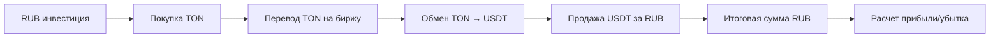
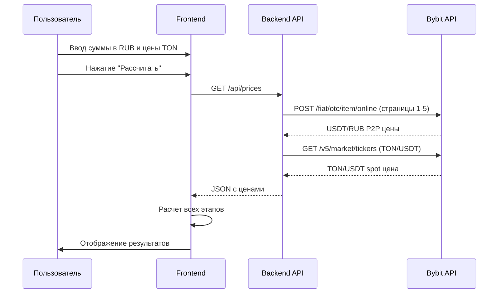

# 🏗️ Архитектура TON Spread Calculator

## 📊 Обзор системы

Калькулятор рассчитывает арбитражную операцию по схеме:
**RUB → TON → USDT → RUB**



## 🔄 Поток данных



## 📁 Структура компонентов

### 1. Backend (server.js)

#### Изменения:
- ✅ Функция `fetchBybitUSDTRubP2P()`: изменить диапазон страниц с 5-8 на **1-5**
- ✅ Сохранить функцию `getBybitSpotPrice()` без изменений
- ✅ Endpoint `/api/prices` возвращает оба курса

#### Логика парсинга P2P (страницы 1-5):

```javascript
// Псевдокод
for (let page = 1; page <= 5; page++) {
    const response = await bybitAPI.post({
        side: '1', // продавцы USDT
        tokenId: 'USDT',
        currencyId: 'RUB',
        page: page
    });
    
    // Собрать все цены
    prices.push(...response.items.map(item => item.price));
}

// Рассчитать среднее
averagePrice = sum(prices) / prices.length;
```

### 2. Frontend (index.html)

#### Входные поля:

**Было:**
- Цена покупки TON (USDT)
- Сумма покупки (USDT)

**Стало:**
- **Цена покупки TON (RUB)** - пользователь вводит вручную
- **Сумма инвестиции (RUB)** - начальный капитал

#### Логика расчета:

```javascript
// Шаг 1: Покупка TON за RUB (комиссия 0.9%)
const tonAmount = (investmentRUB / tonPriceRUB) * (1 - 0.009);

// Шаг 2: Перевод на биржу (минус 0.05 TON)
const tonAfterTransfer = tonAmount - 0.05;

// Шаг 3: Обмен TON → USDT по spot курсу
const usdtBeforeFee = tonAfterTransfer * tonUsdtRate;

// Шаг 4: Комиссия обмена (0.18%)
const usdtAfterFee = usdtBeforeFee * (1 - 0.0018);

// Шаг 5: Продажа USDT за RUB по P2P цене
const finalRUB = usdtAfterFee * usdtRubRate;

// Шаг 6: Прибыль и спред
const profit = finalRUB - investmentRUB;
const spreadPercent = (profit / investmentRUB) * 100;
```

## 🎨 UI/UX Компоненты

### Входная форма:

```
┌────────────────────────────────────┐
│ 💰 TON Spread Calculator          │
├────────────────────────────────────┤
│                                    │
│ Цена покупки TON (RUB):            │
│ [_________175_________]            │
│                                    │
│ Сумма инвестиции (RUB):            │
│ [________40000________]            │
│                                    │
│ [  Рассчитать спред  ] (кнопка)    │
└────────────────────────────────────┘
```

### Результаты (пошаговое отображение):

```
┌────────────────────────────────────┐
│ 📊 РЕЗУЛЬТАТЫ РАСЧЕТА              │
├────────────────────────────────────┤
│ Шаг 1: Покупка TON                 │
│ ┌──────────────────────────────┐   │
│ │ 40,000 RUB ÷ 175 RUB/TON     │   │
│ │ = 228.57 TON                 │   │
│ │ - Комиссия 0.9%: -2.06 TON  │   │
│ │ ✓ Итого: 226.51 TON          │   │
│ └──────────────────────────────┘   │
│                                    │
│ Шаг 2: Перевод на биржу            │
│ ┌──────────────────────────────┐   │
│ │ 226.51 TON                   │   │
│ │ - Комиссия: -0.05 TON        │   │
│ │ ✓ Итого: 226.46 TON          │   │
│ └──────────────────────────────┘   │
│                                    │
│ Шаг 3: Обмен TON → USDT            │
│ ┌──────────────────────────────┐   │
│ │ 226.46 TON × 2.195 USDT/TON  │   │
│ │ = 497.09 USDT                │   │
│ │ - Комиссия 0.18%: -0.89 USDT │   │
│ │ ✓ Итого: 496.20 USDT         │   │
│ └──────────────────────────────┘   │
│                                    │
│ Шаг 4: Продажа USDT → RUB          │
│ ┌──────────────────────────────┐   │
│ │ 496.20 USDT × 80.5 RUB/USDT  │   │
│ │ ✓ Итого: 39,944 RUB          │   │
│ └──────────────────────────────┘   │
│                                    │
│ 💵 ИТОГОВЫЙ РЕЗУЛЬТАТ              │
│ ┌──────────────────────────────┐   │
│ │ Начальная сумма: 40,000 RUB  │   │
│ │ Итоговая сумма:  39,944 RUB  │   │
│ │ Прибыль:         -56 RUB ❌  │   │
│ │ Спред:           -0.14% ❌   │   │
│ └──────────────────────────────┘   │
└────────────────────────────────────┘
```

### Визуализация спреда:

```html
<!-- Progress bar для визуализации спреда -->
<div class="spread-visualization">
    <div class="spread-bar" style="width: X%; background: green/red">
        X.XX%
    </div>
</div>
```

Цветовая индикация:
- 🟢 **Зеленый**: profit >= 0
- 🔴 **Красный**: profit < 0
- Интенсивность цвета зависит от процента прибыли/убытка

## 📊 Детализация комиссий

Отдельный блок с разбивкой всех комиссий:

```
┌────────────────────────────────────┐
│ 💸 ДЕТАЛИЗАЦИЯ КОМИССИЙ            │
├────────────────────────────────────┤
│ Покупка TON:                       │
│   2.06 TON (0.9%)       -360 RUB   │
│                                    │
│ Перевод на биржу:                  │
│   0.05 TON (фикс.)      -8.75 RUB  │
│                                    │
│ Обмен на бирже:                    │
│   0.89 USDT (0.18%)     -71.64 RUB │
│                                    │
│ ВСЕГО КОМИССИЙ:         -440.39 RUB│
└────────────────────────────────────┘
```

## 🔧 API Endpoints

### GET `/api/prices`

**Запрос:**
```http
GET /api/prices
```

**Ответ:**
```json
{
  "success": true,
  "usdtRub": 80.50,
  "tonUsdt": 2.195,
  "p2pSuccess": true,
  "spotSuccess": true,
  "timestamp": "2025-10-31T08:30:00.000Z",
  "details": {
    "usdtRub": {
      "averagePrice": 80.50,
      "priceCount": 50,
      "minPrice": 79.80,
      "maxPrice": 81.20,
      "pages": "1-5"
    },
    "tonUsdt": {
      "lastPrice": 2.195
    }
  }
}
```

### GET `/api/health`

**Запрос:**
```http
GET /api/health
```

**Ответ:**
```json
{
  "status": "ok",
  "timestamp": "2025-10-31T08:30:00.000Z"
}
```

## 🧮 Математические формулы

### Формула прибыльности:

Сделка прибыльна, если:

```
(TON/USDT × USDT/RUB) > (Цена TON в RUB) × K
```

Где K - коэффициент всех комиссий:
```
K = (1 + 0.009) × (1 + 0.05/tonAmount) × (1 + 0.0018)
K ≈ 1.011 (для больших сумм)
```

### Минимальный спред для безубытка:

```
Минимальный спред = (K - 1) × 100%
Минимальный спред ≈ 1.1%
```

## 🎯 Критерии успеха

1. ✅ Корректный расчет всех этапов операции
2. ✅ Автоматическое получение курсов с Bybit
3. ✅ Пошаговое отображение результатов
4. ✅ Визуализация спреда
5. ✅ Детализация всех комиссий
6. ✅ Цветовая индикация прибыльности
7. ✅ Адаптивный дизайн для мобильных устройств
8. ✅ Интеграция с Telegram Mini App

## 🔍 Тестовые сценарии

### Сценарий 1: Прибыльная операция

**Входные данные:**
- Цена TON: 170 RUB
- Инвестиция: 40,000 RUB
- TON/USDT: 2.20
- USDT/RUB: 82

**Ожидаемый результат:**
- Прибыль: ~800 RUB
- Спред: ~2%
- Цвет: зеленый

### Сценарий 2: Убыточная операция

**Входные данные:**
- Цена TON: 175 RUB
- Инвестиция: 40,000 RUB
- TON/USDT: 2.195
- USDT/RUB: 80.5

**Ожидаемый результат:**
- Убыток: ~56 RUB
- Спред: ~-0.14%
- Цвет: красный

### Сценарий 3: Малая сумма

**Входные данные:**
- Цена TON: 175 RUB
- Инвестиция: 1,000 RUB
- TON/USDT: 2.20
- USDT/RUB: 82

**Проверка:**
- После перевода TON > 0
- Корректная обработка комиссии 0.05 TON

## 📝 Чеклист изменений

### Backend (server.js):
- [ ] Изменить `fetchBybitUSDTRubP2P()`: страницы 1-5 вместо 5-8
- [ ] Добавить детальную информацию в ответ API
- [ ] Улучшить обработку ошибок

### Frontend (index.html):
- [ ] Изменить labels и placeholders полей ввода
- [ ] Обновить логику расчета в `calculateSpread()`
- [ ] Добавить пошаговое отображение результатов
- [ ] Создать визуализацию спреда
- [ ] Добавить блок детализации комиссий
- [ ] Улучшить цветовую индикацию
- [ ] Обновить CSS стили

### Документация:
- [ ] Обновить README.md
- [ ] Обновить USAGE.md
- [ ] Обновить QUICKSTART.md
- [ ] Обновить test-calculation.js

## 🚀 План реализации

1. **Фаза 1**: Обновление Backend
   - Изменение парсинга P2P (страницы 1-5)
   - Тестирование получения данных

2. **Фаза 2**: Обновление Frontend
   - Изменение входных полей
   - Обновление логики расчета
   - Базовое отображение результатов

3. **Фаза 3**: Улучшение UI
   - Пошаговое отображение
   - Визуализация спреда
   - Детализация комиссий
   - Цветовая индикация

4. **Фаза 4**: Тестирование
   - Тестирование расчетов
   - Проверка в браузере
   - Проверка в Telegram

5. **Фаза 5**: Документация
   - Обновление всех документов
   - Создание примеров использования

## 🔗 Зависимости

- **axios**: HTTP клиент для запросов к Bybit API
- **express**: Web сервер
- **cors**: CORS middleware
- **cheerio**: Парсинг HTML (если потребуется)

## 📌 Важные замечания

1. Пользователь вводит цену TON в **RUB** вручную
2. Парсинг P2P USDT/RUB происходит при каждом расчете
3. Используется **простое среднее арифметическое** цен с 5 страниц
4. Все промежуточные результаты показываются пользователю
5. Комиссии четко детализированы на каждом этапе